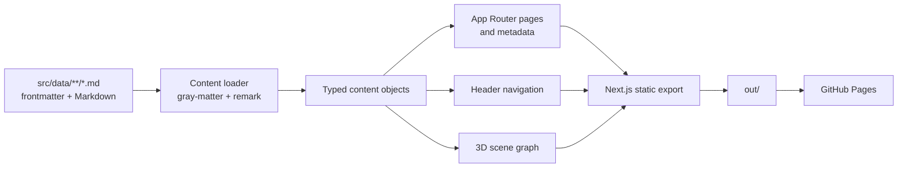
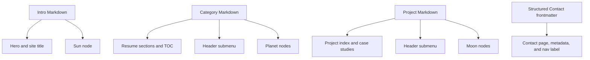
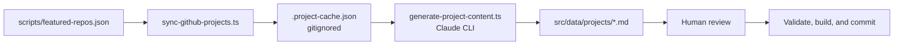

# Architecture

## System overview

The Resume Website is a statically exported Next.js application. Markdown is the content source of truth; build-time loaders turn that content into typed page data, conventional navigation, and a 3D scene graph. The browser receives static HTML and JavaScript, then progressively loads interactive features such as filtering, responsive menus, analytics, and the Three.js scene.

There is no application server after deployment.

## Technology and execution boundaries

| Concern | Implementation | Execution time |
| --- | --- | --- |
| Framework | Next.js 15 App Router and React 19 | Build and browser |
| Language | Strict TypeScript | Build |
| Styling | Tailwind CSS 4, typography plugin, theme tokens, and global visual effects | Build and browser |
| Content | Markdown, YAML frontmatter, `gray-matter`, and `remark` | Build |
| Content editing | Pages CMS configuration over GitHub-authenticated commits | Authoring only |
| 3D | Three.js, React Three Fiber, and `@react-three/drei` | Browser only |
| Analytics | PostHog JS with custom engagement events | Browser only, when configured |
| Hosting | Next.js static export on GitHub Pages | Deployment |
| Project ingestion | GitHub REST metadata plus optional Claude CLI generation | Developer workstation |

## Repository boundaries

- `src/app/` defines route pages, the root layout, metadata, sitemap, robots, and the not-found page.
- `src/components/` contains reusable layout, UI, and client-side components.
- `src/components/three/` contains the complete React Three Fiber experience and its hooks.
- `src/sections/` contains page-level presentation blocks.
- `src/data/` contains the raw Markdown source of truth.
- `src/content/` parses, validates, types, maps, and queries content.
- `scripts/` validates content and runs the GitHub-to-Markdown workflow.
- `public/` contains assets copied into the export.
- `docs/` holds the chronological decision record and operational runbook.
- `wiki/` holds the consolidated product, architecture, feature, and roadmap documentation.

The mandatory boundaries and naming rules are defined in [CLAUDE.md](../CLAUDE.md).

## Routing and static generation

| Route | Source | Generation |
| --- | --- | --- |
| `/` | Intro Markdown plus generated scene graph | Static page |
| `/resume` | Intro and category Markdown | Static page |
| `/projects` | All project Markdown | Static page with client-side tag filtering |
| `/projects/[slug]` | One project Markdown item | One static page per project through `generateStaticParams` |
| `/contact` | Structured Contact frontmatter | Static page |
| Not found | Route-level not-found component | Static fallback |
| `/sitemap.xml` | Fixed routes plus project slugs | Generated at build time |
| `/robots.txt` | Site URL and base path environment values | Generated at build time |

`next.config.ts` enforces:

- `output: 'export'`;
- trailing slashes for static hosts;
- an environment-controlled base path; and
- unoptimized Next images, which are compatible with static export.

The root layout reads navigation data at build time, provides the semantic header/main/footer shell, and wraps browser interactions with the optional analytics provider.

## Content model and validation

Every Markdown document has the shared fields:

- `id`;
- `slug`;
- `title`;
- `type`; and
- `order`.

Content types add their own fields:

- intro: role, photo, and optional orbit appearance;
- category: description, icon, and optional orbit values;
- project: category relationship, optional cover image and alt text, tags, featured state, links, and optional orbit values;
- page: general standalone page content; and
- contact page: required description, introduction, email card, social-link list, location, and availability fields.

The loader recursively reads `src/data/`, parses frontmatter, renders Markdown where present, sorts records by `order`, and provides typed queries for routes and navigation. A required Contact loader supplies its page, navigation label, and metadata from one typed record. Typed queries also prefix CMS-managed profile and project-cover paths with the configured deployment base path without changing their Markdown source values.

The validator rejects:

- missing shared fields;
- invalid content types;
- IDs or slugs that are not lowercase kebab-case;
- invalid ordering values;
- duplicate IDs;
- duplicate slugs;
- projects without a category;
- projects referencing an unknown category;
- Contact pages with missing structured fields, invalid email addresses, non-HTTPS social links, or Markdown body content;
- profile or project images outside `/images/`, with unsafe extensions, or missing from `public/images`; and
- project cover images without alternative text.

`npm run build` runs the validator first through `prebuild`. Links and images embedded directly inside Markdown bodies are not yet validated; this is tracked in the [roadmap](roadmap.md).

## Content editing

`.pages.yml` maps the content types to an authenticated visual editor at Pages CMS:

- Profile, Contact, and the existing Resume sections protect fixed files from creation, rename, and deletion.
- Contact exposes dedicated controls for page metadata, introductory copy, the email card, a reorderable list of HTTPS social links, and the location card.
- Projects can be created and deleted, but not renamed; category selection uses a reference to the Resume collection.
- Resume and project rich-text fields edit Markdown without requiring maintainers to open the source files; Contact deliberately keeps its body empty to protect the card layout.
- Image uploads are restricted to AVIF, JPEG, PNG, and WebP under `public/images`.
- `settings.content.merge` preserves technical frontmatter such as IDs, types, slugs, icons, and 3D orbit settings when it is not exposed by a form.

Pages CMS writes ordinary Git commits to the selected branch. GitHub Actions then validates and statically exports the site. The deployed website contains no CMS runtime, authentication code, content API, or secret.

## Shared content projections

One content set feeds several visible systems:

This projection is the mechanism that keeps the conventional and 3D navigation models aligned.

## 3D scene architecture

The build-time scene builder maps:

- the intro record to the sun;
- resume categories to planets; and
- projects to moons under the planet matching their `categoryId`.

Missing orbit values receive deterministic defaults so newly generated projects can appear without manual 3D tuning.

At runtime:

1. the landing HTML and primary calls to action render first;
2. the scene component is dynamically imported with server rendering disabled;
3. WebGL capability, viewport size, reduced-motion preference, and stored performance mode are detected;
4. a two-state navigation reducer controls system view and focused planet view;
5. camera controls animate between those views unless reduced motion is enabled;
6. URL hashes preserve focused-planet state and support browser history;
7. visible meshes and larger invisible colliders handle pointer selection;
8. a DOM keyboard navigator mirrors the current scene choices; and
9. the canvas stays `aria-hidden`, leaving accessible semantics in the DOM overlay.

If WebGL is unavailable, the scene is replaced with a conventional destination grid.

## Client-side interaction

Client components provide:

- responsive desktop dropdown and mobile accordion navigation;
- mobile menu state;
- active resume-section observation;
- tag filtering and featured-first project ordering;
- the 3D navigation state machine and context panel;
- onboarding-hint persistence in session storage;
- performance-mode persistence in local storage; and
- PostHog pageview and engagement events.

The content and route payloads themselves remain statically generated.

## Accessibility and progressive enhancement

The shared layout provides a skip link and semantic `header`, `nav`, `main`, and `footer` landmarks. Pages use one primary heading, breadcrumbs, visible focus behavior, and conventional links.

The 3D layer respects:

- keyboard access through a DOM listbox;
- touch selection through a select-then-action flow;
- enlarged hit targets;
- `prefers-reduced-motion`;
- performance mode;
- no-WebGL fallback navigation; and
- an assistive-technology-hidden canvas.

The detailed interaction contract lives in [UX patterns and standards](ux-standards.md).

## Analytics

The PostHog provider no-ops when `NEXT_PUBLIC_POSTHOG_KEY` is absent. When configured, it records route pageviews and 12 custom events covering:

- hero calls to action;
- resume section views and TOC use;
- project filtering, card selection, and outbound links; and
- scene selection, exploration, navigation, and hint dismissal.

No backend analytics endpoint is part of this repository. The current deployment configuration gap is documented in the [roadmap](roadmap.md).

## Project content sync pipeline

The optional project-authoring pipeline is separate from the website runtime:

The fetch stage uses the GitHub REST API. The generation stage creates deterministic frontmatter and AI-assisted case-study copy. Existing files are protected unless explicitly forced, locked entries cannot be overwritten, forced updates retain editor-managed cover media, and failed validation restores the previous file. Generated Markdown becomes ordinary committed source content after human review.

See the [runbook](../docs/RUNBOOK.md#syncing-github-projects) for commands and failure recovery.

## Build and deployment

The GitHub Actions workflow:

1. checks out `main`;
2. installs Node.js 20 dependencies with `npm ci`;
3. validates Markdown;
4. creates the static export;
5. uploads `out/`; and
6. deploys the artifact to GitHub Pages.

The deployment build accepts:

- `NEXT_PUBLIC_BASE_PATH` for repository-subdirectory hosting; and
- `NEXT_PUBLIC_SITE_URL` for absolute metadata URLs, sitemap, and robots output.

PostHog also expects `NEXT_PUBLIC_POSTHOG_KEY` and optionally `NEXT_PUBLIC_POSTHOG_HOST`; these are used by the application but are not yet mapped into the deployment build.

## Decision history

This page describes the current architecture. For the chronological rationale and trade-offs behind it, see [Architecture Decisions](../docs/DECISIONS.md).
