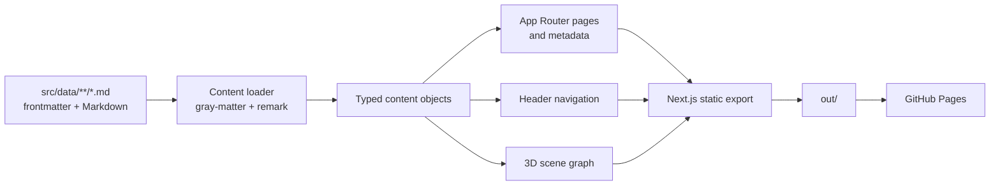
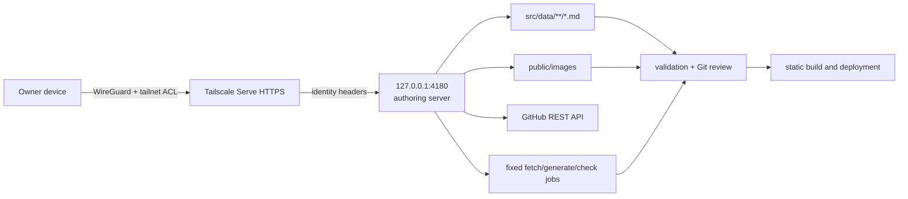
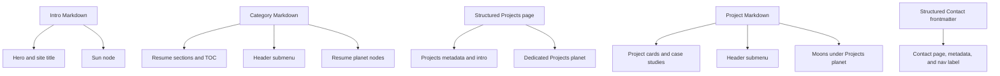
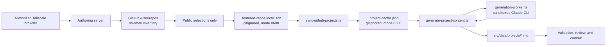

# Architecture

## System overview

The Resume Website is a statically exported Next.js application. Markdown is the content source of truth; build-time loaders turn that content into typed page data, conventional navigation, and a 3D scene graph. The browser receives static HTML and JavaScript, then progressively loads interactive features such as filtering, responsive menus, and the Three.js scene.

There is no application server after deployment.

## Technology and execution boundaries

| Concern | Implementation | Execution time |
| --- | --- | --- |
| Framework | Next.js 15 App Router and React 19 | Build and browser |
| Language | Strict TypeScript | Build |
| Styling | Tailwind CSS 4, typography plugin, theme tokens, and global visual effects | Build and browser |
| Content | Markdown, YAML frontmatter, `gray-matter`, and `remark` | Build |
| Content editing | Identity-gated loopback server through Tailscale Serve | Authoring only |
| 3D | Three.js, React Three Fiber, and `@react-three/drei` | Browser only |
| Hosting | Next.js static export on GitHub Pages | Deployment |
| Project ingestion | GitHub REST metadata plus optional Claude CLI generation | Developer workstation |

## Repository boundaries

- `src/app/` defines route pages, the root layout, metadata, sitemap, robots, and the not-found page.
- `src/components/` contains reusable layout, UI, and client-side components.
- `src/components/three/` contains the complete React Three Fiber experience and its hooks.
- `src/sections/` contains page-level presentation blocks.
- `src/data/` contains the raw Markdown source of truth.
- `src/content/` parses, validates, types, maps, and queries content.
- `scripts/` validates content and runs the GitHub-to-Markdown workflow.
- `public/` contains assets copied into the export.
- `docs/` holds the chronological decision record and operational runbook.
- `wiki/` holds the consolidated product, architecture, feature, and roadmap documentation.

The mandatory boundaries and naming rules are defined in [CLAUDE.md](../CLAUDE.md).

## Routing and static generation

| Route | Source | Generation |
| --- | --- | --- |
| `/` | Intro Markdown plus generated scene graph | Static page |
| `/resume` | Intro and category Markdown | Static page |
| `/projects` | Structured Projects page frontmatter plus all project Markdown | Static page with client-side tag filtering |
| `/projects/[slug]` | One project Markdown item | One static page per project through `generateStaticParams` |
| `/contact` | Structured Contact frontmatter | Static page |
| Not found | Route-level not-found component | Static fallback |
| `/sitemap.xml` | Fixed routes plus project slugs | Generated at build time |
| `/robots.txt` | Site URL and base path environment values | Generated at build time |

`next.config.ts` enforces:

- `output: 'export'`;
- trailing slashes for static hosts;
- an environment-controlled base path; and
- unoptimized Next images, which are compatible with static export.

The root layout reads navigation data at build time and provides the semantic header/main/footer shell.

## Content model and validation

Every Markdown document has the shared fields:

- `id`;
- `slug`;
- `title`;
- `type`; and
- `order`.

Content types add their own fields:

- intro: role, photo, and optional orbit appearance;
- category: description, icon, and optional orbit values;
- project: category relationship, optional cover image and alt text, tags, featured state, links, and optional orbit values;
- page: general standalone page content;
- projects page: required description and introduction plus optional planet orbit values; and
- contact page: required description, introduction, email card, social-link list, location, and availability fields.

The loader recursively reads `src/data/`, parses frontmatter, renders Markdown where present, sorts records by `order`, and provides typed queries for routes and navigation. Required Contact and Projects-page loaders supply page copy, metadata, navigation labels, and scene data from typed records. Typed queries and rendered Markdown share one idempotent URL resolver that prefixes internal routes and local media with the configured deployment base path without changing their Markdown source values.

The validator rejects:

- missing shared fields;
- invalid content types;
- IDs or slugs that are not lowercase kebab-case;
- invalid ordering values;
- duplicate IDs;
- duplicate slugs;
- projects without a category;
- projects referencing an unknown category;
- Projects pages with missing structured copy or Markdown body content;
- Contact pages with missing structured fields, invalid email addresses, non-HTTPS social links, or Markdown body content;
- profile or project images outside `/images/`, with unsafe extensions, or missing from `public/images`; and
- project cover images without alternative text;
- Markdown links to unknown routes or Resume anchors, unsafe relative paths, or unsupported URL schemes; and
- Markdown images outside `/images/`, with unsafe extensions, or missing from `public/images`.

`npm run build` runs the validator first through `prebuild`. Internal content routes are checked against fixed routes, generated project slugs, and Resume section anchors before static export.

## Content editing

The private authoring server is deliberately outside the deployed application:

The backend binds only to loopback and requires an exact Tailscale user identity, same-origin requests, and CSRF protection. Repository credentials stay in the server process. Inventory responses are no-store; private repositories can be viewed by the owner but are blocked from publication at both UI and API boundaries.

The content workspace edits every Markdown record, creates and recoverably deletes project records, uploads validated images, and rolls back writes that fail global content validation. It preserves `src/data/` as the only public content source and produces ordinary Git changes. The server, its APIs, local configuration, repository inventory, and credentials are never included in `out/`.

## Shared content projections

One content set feeds several visible systems:

This projection is the mechanism that keeps the conventional and 3D navigation models aligned.

## 3D scene architecture

The build-time scene builder maps:

- the intro record to the sun;
- resume categories to Resume planets;
- the structured Projects page record to a dedicated Projects planet; and
- every project to a moon beneath the Projects planet.

Missing orbit values receive deterministic defaults so newly generated projects can appear without manual 3D tuning.

Each scene node also carries a semantic `destination` separate from its visual body type. That distinction lets Resume and Projects both render as planets while preserving different primary routes and action labels. A project's `categoryId` remains a validated content relationship, not its visual parent in the scene.

At runtime:

1. the landing HTML and primary calls to action render first;
2. the scene component is dynamically imported with server rendering disabled;
3. WebGL capability, viewport size, reduced-motion preference, and stored performance mode are detected;
4. a two-state navigation reducer controls system view and focused planet view;
5. camera controls animate between those views unless reduced motion is enabled;
6. URL hashes preserve focused-planet state and support browser history;
7. visible meshes and larger invisible colliders handle pointer selection;
8. a DOM keyboard navigator mirrors the current scene choices; and
9. the canvas stays `aria-hidden`, leaving accessible semantics in the DOM overlay.

If WebGL is unavailable, the scene is replaced with a conventional destination grid.

## Client-side interaction

Client components provide:

- responsive desktop dropdown and mobile accordion navigation;
- mobile menu state;
- active resume-section observation;
- tag filtering and featured-first project ordering;
- the 3D navigation state machine and context panel;
- onboarding-hint persistence in session storage; and
- performance-mode persistence in local storage.

The content and route payloads themselves remain statically generated.

## Accessibility and progressive enhancement

The shared layout provides a skip link and semantic `header`, `nav`, `main`, and `footer` landmarks. Pages use one primary heading, breadcrumbs, visible focus behavior, and conventional links.

The 3D layer respects:

- keyboard access through a DOM listbox;
- touch selection through a select-then-action flow;
- enlarged hit targets;
- `prefers-reduced-motion`;
- performance mode;
- no-WebGL fallback navigation; and
- an assistive-technology-hidden canvas.

The detailed interaction contract lives in [UX patterns and standards](ux-standards.md).

## Project content sync pipeline

The optional project-authoring pipeline is invoked from the private server and remains separate from the website runtime:

The owner can inspect private repository names inside the authenticated no-store session, but private entries are disabled in the UI and rejected again during save and fetch. Existing Markdown is protected unless generation is explicitly forced, locked entries cannot be overwritten, forced updates retain editor-managed cover media, and failed validation restores the previous file.

Repository metadata and README text are untrusted prompt input, so the Claude CLI runs behind `scripts/generation-worker.ts` with a reduced environment and no tools, and every `src/data/projects` destination is resolved through `scripts/project-paths.ts`. The [runbook](../docs/RUNBOOK.md#generation-sandbox) states the exact boundary.

See the [runbook](../docs/RUNBOOK.md#github-project-ingestion) for access and failure recovery.

## Build and deployment

The GitHub Actions workflow:

1. checks out pull requests, `main`, or a manual run;
2. installs Node.js 22 dependencies with `npm ci`;
3. runs ESLint with zero warnings;
4. runs focused Vitest coverage;
5. validates Markdown and creates the static export; and
6. uploads and deploys `out/` only outside pull requests.

The deployment build accepts:

- `NEXT_PUBLIC_BASE_PATH` for repository-subdirectory hosting; and
- `NEXT_PUBLIC_SITE_URL` as the origin for absolute metadata URLs, sitemap, and robots output.

Analytics is intentionally disabled; the build accepts no analytics keys or hosts.

## Decision history

This page describes the current architecture. For the chronological rationale and trade-offs behind it, see [Architecture Decisions](../docs/DECISIONS.md).
